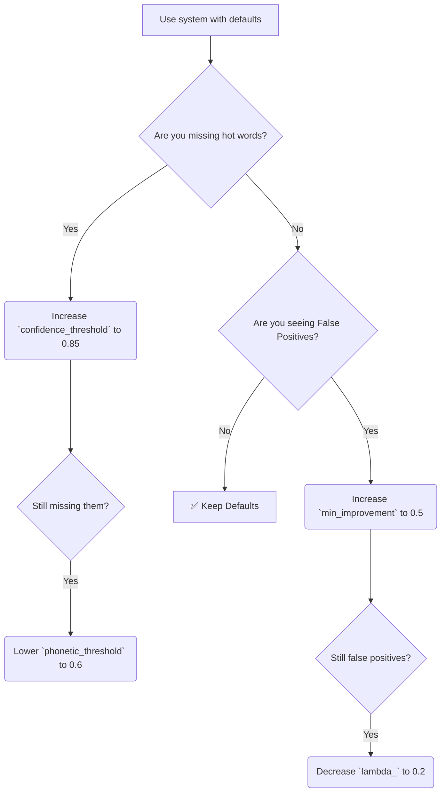

# Parameter Tuning

Context-Based Captioning uses sensible general-use defaults. However, different audio environments, microphone qualities, and academic domains may require tuning to achieve optimal Word Error Rate (WER) improvements.

## Core Parameters

When calling `rescore_transcript`, you can configure four critical thresholds:

1. **`confidence_threshold` (Default: 0.7)**
   - *What it does:* Whisper's certainty required before we inherently trust it. If Whisper's confidence is *below* this, we attempt to fix the word.
   - *If too high:* System triggers on everything. Massive slow down, risk of false positives.
   - *If too low:* System ignores actual errors because Whisper was overly confident in its hallucination.

2. **`phonetic_threshold` (Default: 0.7)**
   - *What it does:* The minimum similarity (0.0 to 1.0) between Whisper's predicted word and your hot word before it's considered a candidate.
   - *If too high:* Misses correctly identifying misspellings. (e.g., "iron value" vs "eigenvalue" is mathematically rated at 0.75).
   - *If too low:* Spams the Language Model with irrelevant hot words, slowing down inference.

3. **`lambda_` (Default: 0.4)**
   - *What it does:* The weight of the GPT-2 evaluation. Limits how aggressively the language model overrides the acoustic model.
   - *If too high:* GPT-2 forces technically correct grammar into sentences even if the speaker stuttered or misspoke.
   - *If too low:* Doesn't provide enough score differential to actually trigger replacements.

4. **`min_improvement` (Default: 0.3)**
   - *What it does:* The hurdle rate. The candidate hot word's log-likelihood must clear the original word's by this margin to be selected.
   - *If too high:* Extremely conservative. Replaces almost nothing.
   - *If too low:* Over-aggressive. Will replace correct but rare words with similar-sounding common hot words just because they fit the grammar slightly better.

---

## The Tuning Process Flowchart

Should you optimize your parameters? Follow this logic:

## Domain-Specific Recommendations

Based on empirical testing, different academic domains behave differently.

### 🧬 Biology & Medicine
Medical terms are often highly multisyllabic ("deoxyribonucleic", "mitochondria"). They exhibit lower phonetic similarity when Whisper fails entirely.
- `phonetic_threshold = 0.6`
- `min_improvement = 0.2`

### 📐 Computer Science & Math
Terms are often short, common compound words ("tree", "graph", "hash map") creating a huge risk for false positives.
- `confidence_threshold = 0.6`
- `min_improvement = 0.5`
- `lambda_ = 0.3`

---

## Automated Optimization

If you have a ground-truth transcript for a sample of your audio, you can automatically optimize parameters for your domain. See our example script at `docs/examples/parameter_tuning.py`.

It performs a grid search over the multi-dimensional parameter space to maximize the F1-score of technical term detection while constraining false positives.

### Best Practices for Tuning
- **Don't overfit:** Never tune on a 1-minute clip and expect it to generalize to an hour. Tune on a validation set of at least 10 minutes of varied speech.
- **Microphone consistency:** If you tuned your audio for a lavalier microphone, the parameters will not generalize well to a webcam mic across a large echoey room (where baseline Whisper confidence drops significantly).
