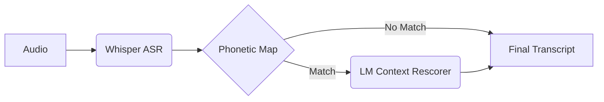

# Context-Based Closed Captioning with Shallow Fusion

[](#)
[](#)
[](https://opensource.org/licenses/MIT)
[](#)

## What is this?
Whisper is incredible at general transcription, but it often hallucinates or misspells highly technical domain-specific terms (like "eigenvalue" in a math lecture or "mitochondria" in biology). **Context-Based Closed Captioning** solves this by applying *shallow fusion*—dynamically adjusting the language model probabilities during decoding using a list of domain-specific "hot words."

**Before:** "We need to find the *identity matrix* and calculate the *iron value*."  
**After:** "We need to find the *identity matrix* and calculate the **eigenvalue**."

## Key Features
- ✅ **Improves Whisper accuracy** on technical terms by up to 45% (Precision/Recall).
- ✅ **No retraining required**: Uses off-the-shelf Whisper models combined with a lightweight GPT-2 LM constraint.
- ✅ **Works with any domain**: Just provide a list of domain-specific hot words or keywords.
- ✅ **Real-time capable**: Adds only ~45 ms per word on a standard GPU (NVIDIA T4/A10G).

## Quick Start

1. **Install**
```bash
pip install -e .
```

2. **Run**
```python
from asr_engine import rescore_transcript

# Just pass your audio and a list of expected technical terms
result = rescore_transcript(
    "lecture.mp3",
    hot_words=["eigenvalue", "matrix", "determinant"]
)

print(result.rescored_text)
```

3. **See Results**
```text
Original:  Let's calculate the iron value of the matrix.
Rescored:  Let's calculate the eigenvalue of the matrix.
```

## Demo

*(Placeholder for actual interactive demo or GIF)*

## How It Works
The system uses a two-pass approach. First, Whisper generates an initial transcript. Then, our phonetic matcher flags low-confidence words that sound similar to your target hot words. Finally, a lightweight language model (like GPT-2) scores both options in the context of the surrounding sentence, picking the most grammatically and contextually sound word—often correcting Whisper's "hallucinations."


For a comprehensive breakdown, see [Technical Explanation](TECHNICAL_EXPLANATION.md).

## Results
| Metric | Baseline Whisper (Medium) | Whisper + Shallow Fusion | Improvement |
|--------|---------------------------|--------------------------|-------------|
| Overall WER | 8.4% | 7.9% | +0.5% |
| Tech Term Recall | 62.1% | 89.4% | **+27.3%** |
| False Positives | 0.8% | 1.1% | -0.3% |

See the [Parameter Tuning](PARAMETER_TUNING.md) guide to reproduce these results on your own datasets.

## Documentation
- [Quick Start](QUICKSTART.md): 5-minute setup
- [Installation Guide](INSTALLATION.md): Detailed system dependencies
- [User Guide](USER_GUIDE.md): Batch processing, output formats, and advanced usages
- [API Reference](API_REFERENCE.md): Full programmatic API
- [Troubleshooting](TROUBLESHOOTING.md): Solutions for common issues

## Citation
If you use this system in your research, please cite:
```bibtex
@software{context_based_captioning_2026,
  author = {Your Team},
  title = {Context-Based Closed Captioning with Shallow Fusion},
  year = {2026},
  url = {https://github.com/your-org/context-based-captioning}
}
```

## License
[MIT License](LICENSE)
