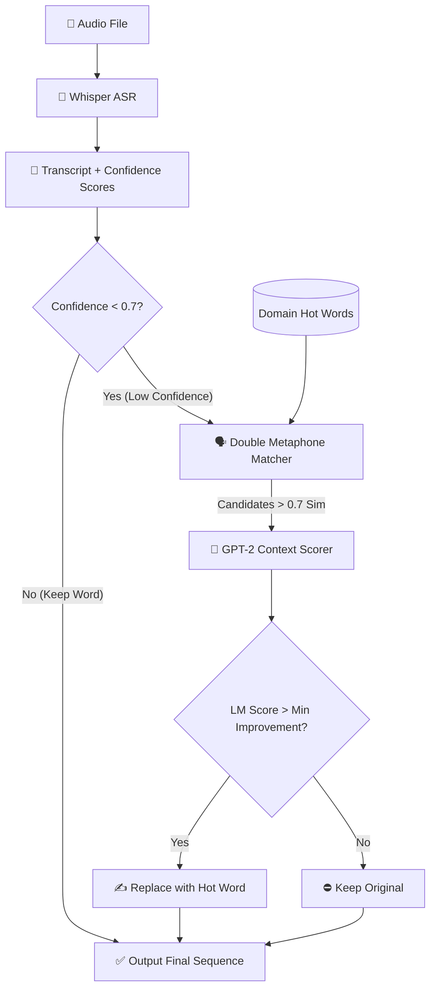

# Technical Explanation

This document is intended for technical readers, engineers, and ML researchers who want to understand how Context-Based Closed Captioning (Shallow Fusion) works natively.

## 1. Problem Statement

Offline speech recognition models like Whisper achieve incredibly low Word Error Rates (WER) on general conversation. However, Whisper is highly prone to hallucinatory misspellings when it encounters technical, niche, or domain-specific jargon. 

Because Whisper was trained on broad internet audio, its implicit language model favors common words over rare ones. 
- Example: Whisper hears "eye-gen-val-yoo"
- It maps the phonetic sounds to common words: "iron value" or "I join value"
- It fails to map it to the rare technical term: "eigenvalue"

If standard transcription fails, how do we fix it? Fine-tuning Whisper on domain-specific data is computationally expensive and causes catastrophic forgetting for general terms. Our solution is **post-hoc shallow fusion**.

## 2. Shallow Fusion Explained

In deep fusion, an external language model is integrated directly into the hidden states of an ASR's decoder graph. While highly accurate, this requires deep modification of the underlying ASR architecture and often slows inference significantly.

**Shallow fusion** evaluates ASR hypotheses by merging the ASR's acoustic/linguistic score with an external Language Model (LM) score at decoding time. 

Our explicit formula for assigning a score $S$ to a candidate word sequence $W$ given audio context $X$ is:

$$ S(W) = \log P_{ASR}(W|X) + \lambda \log P_{LM}(W) $$

Where:
- $P_{ASR}(W|X)$ is the probability assigned by Whisper.
- $P_{LM}(W)$ is the probability assigned by our contextual constraint model (e.g., GPT-2).
- $\lambda$ is the interpolation factor dictating how much we trust the external LM.

By evaluating both the original Whisper hypothesis and a candidate sequence containing a domain-specific "hot word," we can objectively compare which sentence is mathematically more sound.

## 3. Implementation Details

Our pipeline implements this formula via a fast, three-step "Trigger, Candidate, Context" process to avoid running the expensive LM repeatedly.

1. **Triggering (Confidence Thresholding):**
   Whisper exports word-level confidence scores. The system only triggers on words with a confidence score below a threshold (default $\tau = 0.7$). If Whisper is 98% confident in a word, we trust it and save compute.

2. **Candidate Generation (Phonetic Matching Algorithm):**
   When triggered, we calculate phonetic distances between Whisper's low-confidence word and our user-provided `hot_words`. 
   We evaluate phonetic similarity using the **Double Metaphone algorithm** combined with Levenshtein distance. This generates a list of phonetically viable candidate replacements.

3. **LM Context Scoring:**
   We construct two sentences:
   - $S_{orig}$: The preceding sentence + [original word]
   - $S_{cand}$: The preceding sentence + [candidate hot word]
   
   We pass both constructed sentences into GPT-2. If $\log P_{LM}(S_{cand}) - \log P_{LM}(S_{orig}) > \text{min\_improvement}$, we override Whisper and output the hot word.

## 4. Design Choices

### Why Double Metaphone over Soundex?
Soundex truncates encoding to essentially 4 characters, which ruins the nuance of long technical terms (e.g., "mitochondria" and "mitosis" collapse similarly). Metaphone encodes much closer to standard English pronunciation rules and handles consonant variations better.

### Why GPT-2 over BERT?
BERT is a masked language model (MLM). While it is great at bidirectional context, computing the auto-regressive likelihood of a full sequence natively is inefficient compared to a causal model like GPT-2, which inherently outputs the log-probability of the next token. This makes GPT-2 mathematically aligned with the $P_{LM}(W)$ term.

## 5. Architectural Diagram

